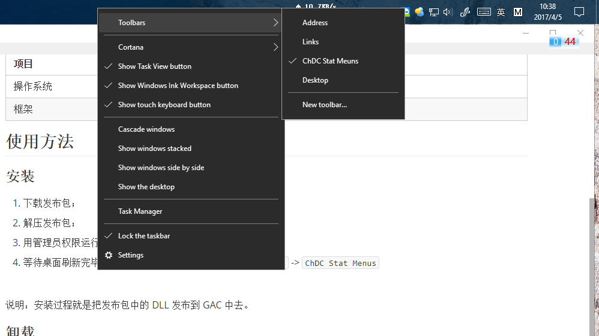
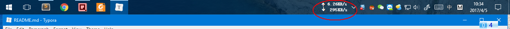
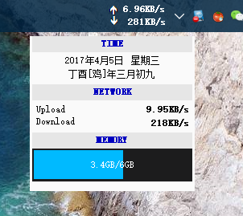
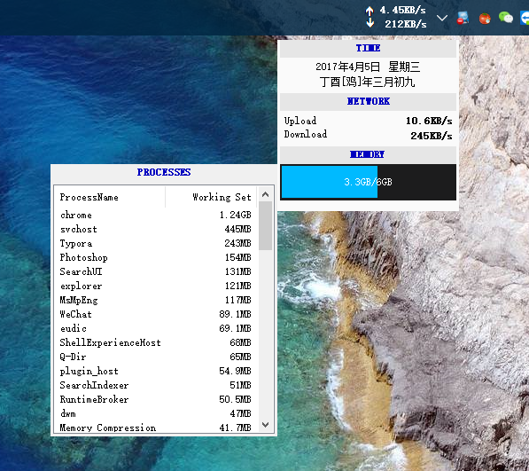

# ChDCStatMenus
用于Windows任务栏的实时网速显示程序。A desk band for Windows to show network speed continually.

## 功能

* 实时网速

* 实时物理内存使用情况等

* 每个进程的物理内存占用

  合并同名进程或父子进程内存

## 平台及环境

| 项目   | 项目         |
| ---- | ---------- |
| 操作系统 | Windows 10 |
| 框架   | .NET 4.6   |

## 使用方法

### 安装

1. 下载发布包；

2. 解压发布包；

3. 用管理员权限运行发布包中的 `install.bat` 脚本。

4. 等待桌面刷新完毕之后，`在任务栏处右击` -> `工具栏(Toolbars)` -> `ChDC Stat Menus`

   

   注意：我电脑上任务栏是放在顶部的。

说明：安装过程就是把发布包中的 DLL 发布到 GAC 中去。

### 卸载

1. 用管理员权限运行发布包中的 `uninstall.bat` 脚本。

## 截图

### 实时网速显示效果

### 其他信息显示效果

### 进程内存占用情况显示效果

